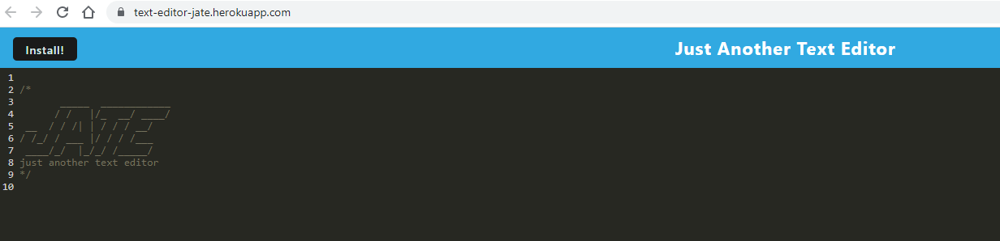

# PWA Text Editor
Use this note taker in your daily life to keep track of your tasks, contact information or anything you need both online and offline.

### Website Features:
1) Data Persists in the window upon refresh even without local storage
2) Install button allows the application to be used with offline functionality
3) Data is saved without the need of a save button

### What I learned from the creation of this site:
* A basic understanding of PWAs
* An alternative form of data storage instead of local storage
* Icon usage and sizing methods

Create your own planner for today at: [Vincent D Momot's Planner](https://text-editor-jate.herokuapp.com/)

Screenshots of the site:

